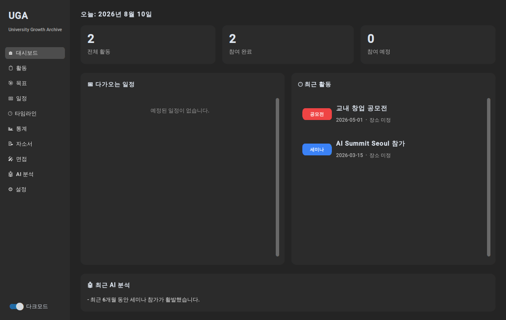
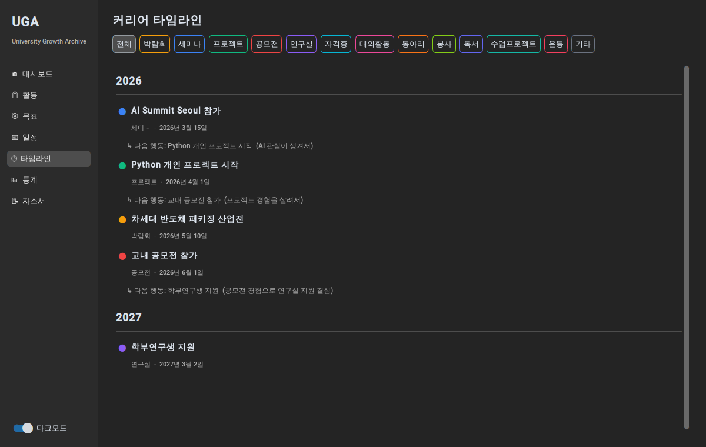
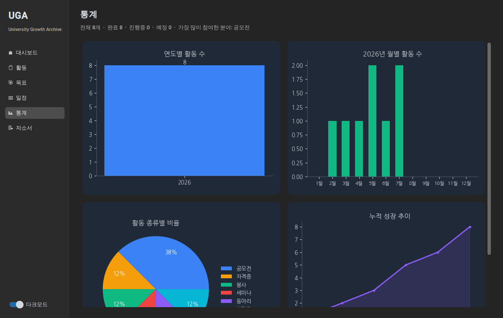
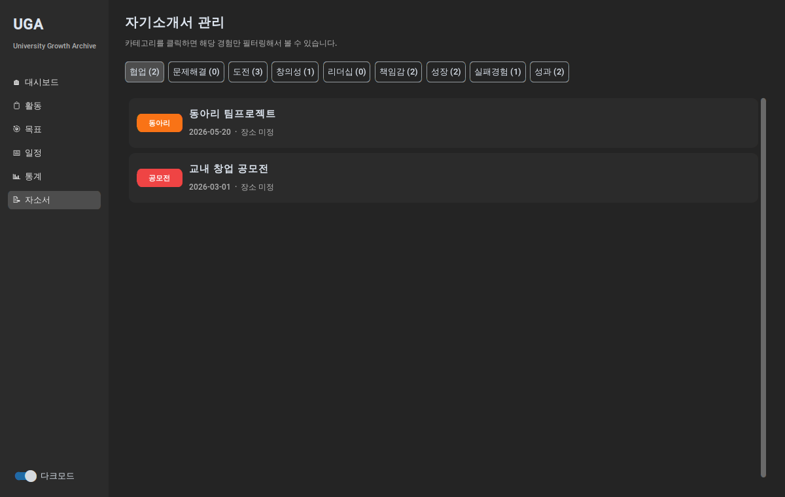
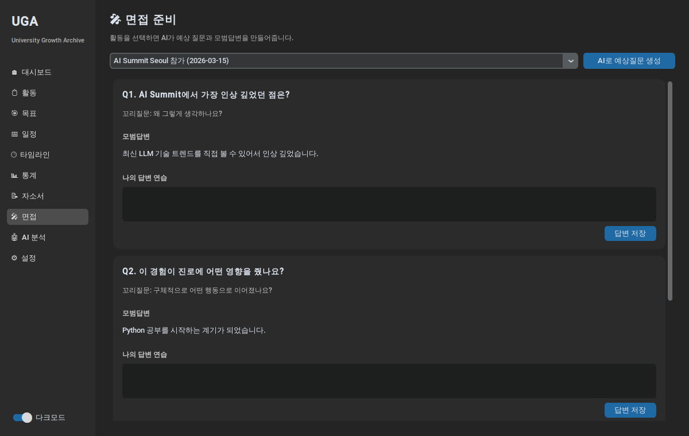
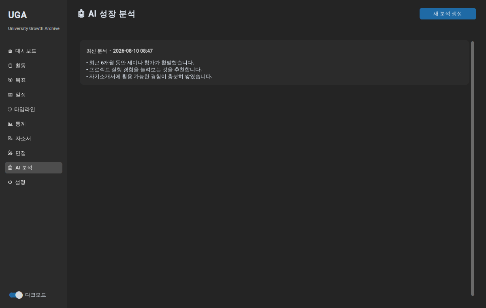
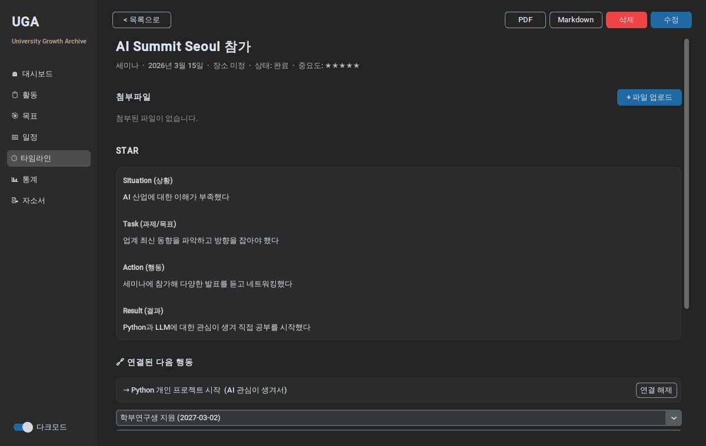

# University Growth Archive (UGA)

[](https://github.com/sigseung/university-growth-archive/actions/workflows/tests.yml)

> 대학생활 4년을 기록하고, AI로 성장 관리·자기소개서·면접·커리어 관리까지
> 연결하는 "대학생 성장 운영체제". 단순 CRUD 앱이 아니라, 활동 간의
> 인과관계를 기록해 성장 흐름을 시각화하는 데 초점을 맞췄습니다.



## 왜 만들었나

컴퓨터공학 전공이 아닌 상태로 Python을 배우며 실제 대학생활에 써먹을 수 있는
프로그램을 만들고 싶어서 시작한 개인 프로젝트입니다. V1(활동 기록)부터
V6(완성도)까지 실제 스타트업처럼 버전을 나눠 순서대로 개발했습니다.

## 핵심 기능

| 기능 | 설명 |
|---|---|
| 활동 기록 | 박람회/세미나/프로젝트/공모전 등 13종 활동을 태그·목표·자소서 카테고리와 함께 기록 |
| **성장 연결 (GrowthLink)** | "활동 A가 활동 B로 이어졌다"는 인과관계를 저장 — 이 프로젝트의 핵심 |
| 커리어 타임라인 | 연도별로 활동을 나열하고, 연결된 다음 행동을 시각화 |
| 목표 관리 | 목표에 활동을 연결하면 진행률이 자동 계산 |
| 통계 | 연도별/월별/종류별 활동 현황을 그래프로 |
| 자기소개서 관리 | 활동을 협업/도전/리더십 등 9종 카테고리로 분류해 필터링 |
| PDF / Markdown Export | 활동 하나를 포트폴리오 문서로 내보내기 |
| **AI 기능** | Reflection·STAR 초안 생성, 자소서 문단 생성, 면접 예상질문, 성장 분석 리포트 |
| 자동 백업 | 하루 1회 자동 백업, 최근 14개 보관, 설정 화면에서 즉시 백업/복원 |

## 스크린샷

<table>
<tr>
<td><br/>커리어 타임라인</td>
<td><br/>통계</td>
</tr>
<tr>
<td><br/>자기소개서 관리</td>
<td><br/>면접 준비 (AI)</td>
</tr>
<tr>
<td><br/>AI 성장 분석</td>
<td><br/>활동 상세</td>
</tr>
</table>

## 기술 스택

Python · CustomTkinter · SQLAlchemy (SQLite) · Matplotlib · ReportLab ·
OpenAI API · pytest · PyInstaller

**아키텍처**: View → 이벤트 핸들러 → Service → Repository → Model 계층으로 분리해서,
DB 쿼리(Repository)와 비즈니스 규칙(Service)이 섞이지 않도록 했습니다.
핵심 엔티티와 설계 선택의 이유는 [아키텍처 문서](docs/architecture.md)에 정리했습니다.

## 실행 방법

```bash
git clone <이 저장소 URL>
cd uga
pip install -r requirements.txt
python main.py
```

### 한글 폰트 (통계 그래프 / PDF export)
Windows/macOS는 기본 내장 폰트(맑은 고딕 / 애플 고딕)를 자동으로 찾아 씁니다.
Linux는 나눔고딕 설치가 필요합니다:
```bash
sudo apt-get install fonts-nanum
```

### AI 기능 사용 준비
AI 기능(성장 분석 / 면접 준비 / 자소서 문장 생성 / Reflection·STAR 초안)을 쓰려면
[OpenAI API 키](https://platform.openai.com/api-keys)가 필요합니다.
앱 실행 후 사이드바 **설정** 화면에서 입력하면 로컬 `settings.json`에 저장됩니다
(`.gitignore`에 등록되어 있어 커밋되지 않습니다). 환경변수로도 설정 가능합니다:
```bash
export OPENAI_API_KEY=sk-...
```

### 실행파일로 빌드 (배포용)
Python 없이도 실행할 수 있는 단일 실행파일을 만들 수 있습니다.
```bash
pip install -r requirements-dev.txt
pyinstaller uga.spec
```
결과물은 `dist/UGA/` 아래에 생성됩니다 (Windows는 `UGA.exe`, macOS는 `UGA.app`).

## 테스트

핵심 비즈니스 로직(목표 진행률 자동 계산, 성장 연결의 자기참조 방지,
AI 응답 파싱, 백업/복원 등)은 pytest로 검증되어 있습니다.
실제 사용자 DB를 절대 건드리지 않도록 테스트마다 임시 SQLite 파일을 사용합니다.

```bash
pip install -r requirements-dev.txt
pytest -v
```

GitHub에서는 `main` 브랜치 푸시와 Pull Request마다 Python 3.11·3.12 환경에서
동일한 테스트를 자동 실행합니다. 배지가 실패하면 병합 전에 원인을 확인합니다.

## 프로젝트 구조

```
uga/
├── main.py / config.py
├── models/          # SQLAlchemy 테이블 정의 (Activity가 중심, 나머지가 방사형으로 연결)
├── database/         # 엔진/세션, 백업 복원 시 재연결 지원
├── repositories/       # DB CRUD 전담 (SQL은 여기에만)
├── services/            # 비즈니스 로직 (진행률 계산, 태그/카테고리 배정, 백업 등)
├── ai/                    # AI 기능 전담 (OpenAI 호출은 ai_client.py 한 곳에만)
│   └── prompts/             # 프롬프트 템플릿
├── analytics/               # 통계 집계 + Matplotlib 차트
├── timeline/                  # 커리어 타임라인 데이터 가공
├── views/                       # CustomTkinter 화면 (10개 메뉴)
│   └── components/               # 재사용 위젯
├── utils/                          # 날짜/파일/폰트/설정 저장 헬퍼
├── tests/                            # pytest (34개 테스트)
└── uga.spec                            # PyInstaller 빌드 설정
```

## 개발 과정에서 마주친 문제들

- **한글 PDF가 네모(□)로 깨짐**: reportlab이 `.ttc`(폰트 컬렉션) 파일의 글리프를
  잘못 읽는 문제였습니다. PDF 생성 시에는 `.ttc`를 후보에서 제외하고 단일 `.ttf`만
  쓰도록 `utils/font_utils.py`에서 처리했습니다.
- **AI 응답이 항상 정직한 JSON은 아님**: 모델이 가끔 마크다운 코드블록으로 감싸서
  답하거나 형식을 어기는 경우가 있어, 파싱 실패를 명확한 에러 메시지로 바꿔 사용자에게
  "다시 시도해주세요"라고 안내하도록 했습니다.
- **API 키가 없어도 앱이 죽으면 안 됨**: AI 기능을 전혀 안 쓰는 사용자도 있을 수 있어,
  `AIConfigError`로 감싸서 AI 관련 화면 외에는 전혀 영향이 없게 격리했습니다.

## 로드맵 (개발 순서)

- [x] V1 — 활동 CRUD, 대시보드, 태그 검색, Reflection, 다크모드
- [x] V2 — 목표 + 진행률 자동 계산, 일정 + 달력, 첨부파일 업로드
- [x] V3 — 자기소개서 분류, 통계, PDF/Markdown Export
- [x] V4 — 성장 연결(GrowthLink), 커리어 타임라인, STAR 필드
- [x] V5 — AI 기능 통합 (Reflection/STAR/자소서/면접 생성, 성장 분석)
- [x] V6 — 자동 백업/복원, PyInstaller 패키징, 테스트 34개, 문서 정리
